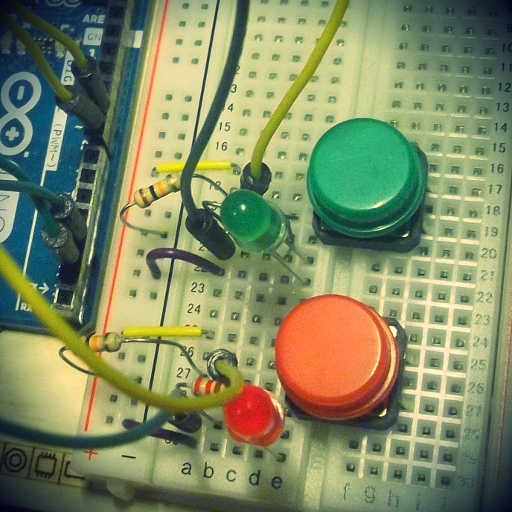
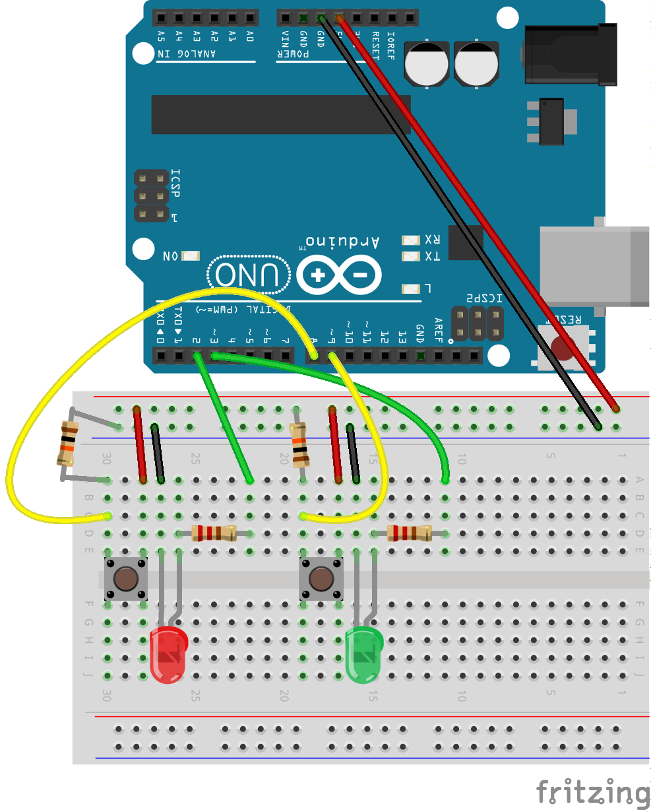
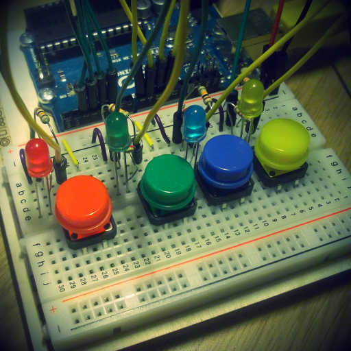
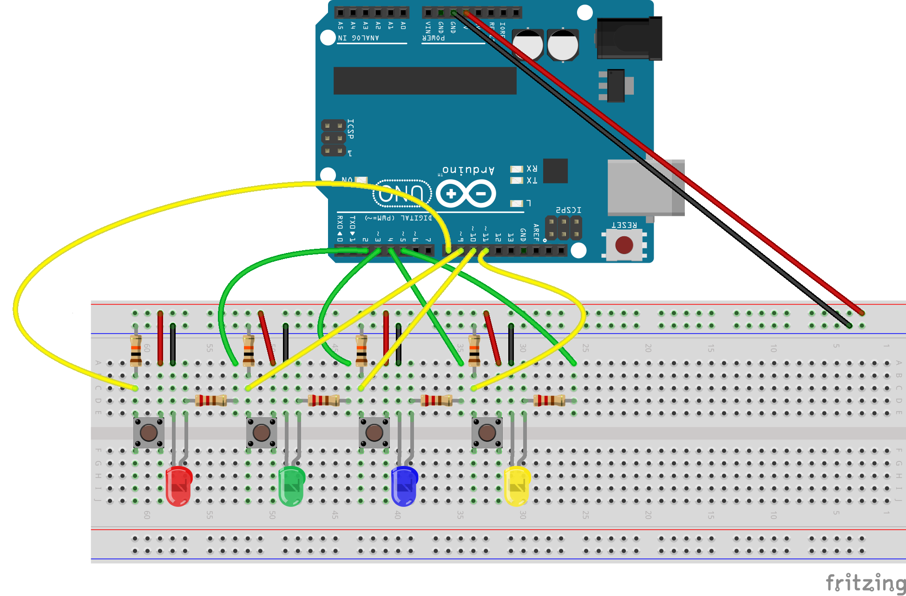
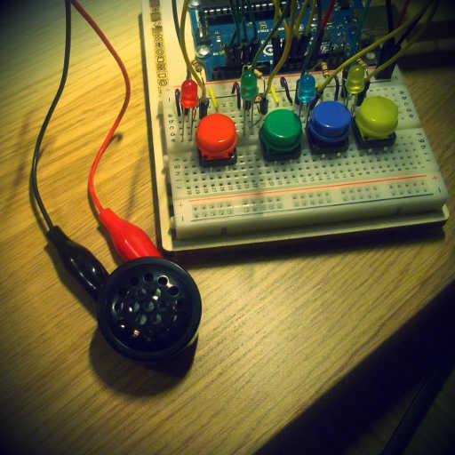
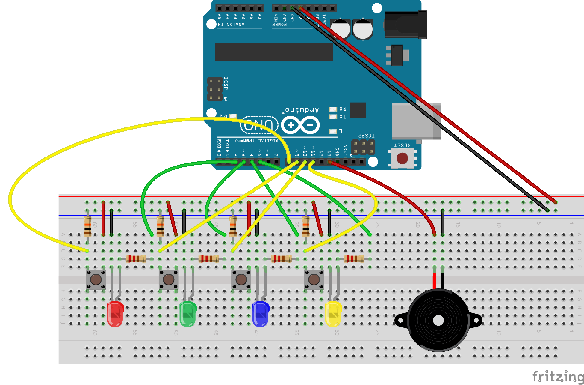

Simon Game with Arduino
============================

Description
-----------

My goal is to build the game of [Simon](http://en.wikipedia.org/wiki/Simon_%28game%29)
from a prototype with Arduino to a real object. I'm doing/writing this to
improve my skills in Arduino and electronic.

Step 1
------

### The Object

### Rules

Only 2 colors, red and green. The machine gives a color by lighting a LED then
the player respond by pressing a color button. If this is the right response
the player win and a new game begin. If the response is not correct all LEDs
blink for some time to indicate that the game is lost and a new game
begin. Simple enough.

### Components

- 2 LEDs, one red, one green.
- 2 colorful momentary buttons.
- 2 resistors of 220 Ohms, for the LEDs.
- 2 resistors of 10k Ohms, for the buttons.

### Schema

### The Code

Check out [the code for step 1](https://github.com/lkdjiin/simon-with-arduino/releases/tag/step01)

Step 2
------

### The object

### Rules

This is the exact same rules as step 1, but now with 4 colors.

### Components

- 4 LEDs : red, green, blue and yellow.
- 4 colorful momentary buttons.
- 4 resistors of 220 Ohms, for the LEDs.
- 4 resistors of 10k Ohms, for the buttons.

### Schema

### The Code

Check out [src/sketch.ino](https://github.com/lkdjiin/simon-with-arduino/releases/tag/step2)

Step 3
------

### The object

### Rules

Same rules as step 2.

### Components

- 4 LEDs : red, green, blue and yellow.
- 4 colorful momentary buttons.
- 4 resistors of 220 Ohms, for the LEDs.
- 4 resistors of 10k Ohms, for the buttons.
- A piezzo.

### Schema

### The Code

Check out [src/sketch.ino](src/sketch.ino)

License
-------

MIT

Questions and/or Comments
-------------------------

Feel free to email [Xavier Nayrac](mailto:xavier.nayrac@gmail.com) with any
questions, or contact me on [twitter](https://twitter.com/lkdjiin).
